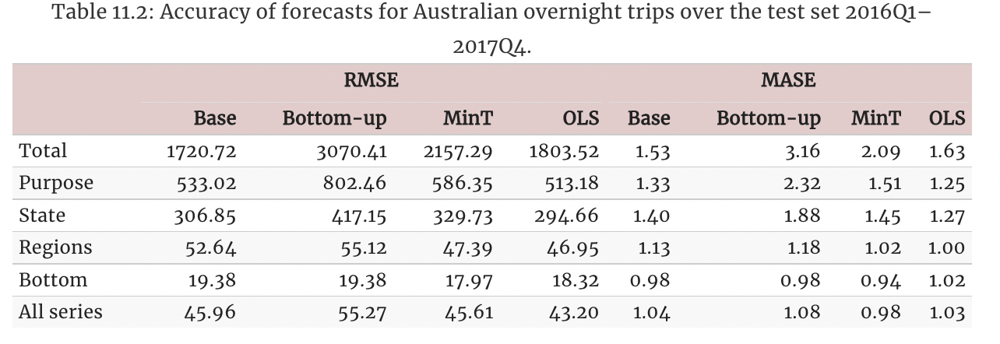

> Geographical Hierarchical Forecasting on Australian Tourism Data

In many applications, a set of time series is hierarchically organized.
Examples include the presence of geographic levels, products, or
categories that define different types of aggregations. In such
scenarios, forecasters are often required to provide predictions for all
disaggregate and aggregate series. A natural desire is for those
predictions to be **“coherent”**, that is, for the bottom series to add
up precisely to the forecasts of the aggregated series.

In this notebook we present an example on how to use
`HierarchicalForecast` to produce coherent forecasts between
geographical levels. We will use the classic Australian Domestic Tourism
(`Tourism`) dataset, which contains monthly time series of the number of
visitors to each state of Australia.

We will first load the `Tourism` data and produce base forecasts using
an `AutoETS` model from `StatsForecast`, and then reconciliate the
forecasts with several reconciliation algorithms from
`HierarchicalForecast`. Finally, we show the performance is comparable
with the results reported by the [Forecasting: Principles and
Practice](https://otexts.com/fpp3/tourism.html) which uses the R package
[fable](https://github.com/tidyverts/fable).

You can run these experiments using CPU or GPU with Google Colab.

<a href="https://colab.research.google.com/github/Nixtla/hierarchicalforecast/blob/main/nbs/examples/AustralianDomesticTourism.ipynb" target="_parent"></a>

```python
%%capture
!pip install hierarchicalforecast statsforecast
```

## 1. Load and Process Data

In this example we will use the
[Tourism](https://otexts.com/fpp3/tourism.html) dataset from the
[Forecasting: Principles and Practice](https://otexts.com/fpp3/) book.

The dataset only contains the time series at the lowest level, so we
need to create the time series for all hierarchies.

```python
import numpy as np
import pandas as pd
```


```python
Y_df = pd.read_csv('https://raw.githubusercontent.com/Nixtla/transfer-learning-time-series/main/datasets/tourism.csv')
Y_df = Y_df.rename({'Trips': 'y', 'Quarter': 'ds'}, axis=1)
Y_df.insert(0, 'Country', 'Australia')
Y_df = Y_df[['Country', 'Region', 'State', 'Purpose', 'ds', 'y']]
Y_df['ds'] = Y_df['ds'].str.replace(r'(\d+) (Q\d)', r'\1-\2', regex=True)
Y_df['ds'] = pd.PeriodIndex(Y_df["ds"], freq='Q').to_timestamp()
Y_df.head()
```

|     | Country   | Region   | State           | Purpose  | ds         | y          |
|-----|-----------|----------|-----------------|----------|------------|------------|
| 0   | Australia | Adelaide | South Australia | Business | 1998-01-01 | 135.077690 |
| 1   | Australia | Adelaide | South Australia | Business | 1998-04-01 | 109.987316 |
| 2   | Australia | Adelaide | South Australia | Business | 1998-07-01 | 166.034687 |
| 3   | Australia | Adelaide | South Australia | Business | 1998-10-01 | 127.160464 |
| 4   | Australia | Adelaide | South Australia | Business | 1999-01-01 | 137.448533 |

The dataset can be grouped in the following non-strictly hierarchical
structure.

```python
spec = [
    ['Country'],
    ['Country', 'State'], 
    ['Country', 'Purpose'], 
    ['Country', 'State', 'Region'], 
    ['Country', 'State', 'Purpose'], 
    ['Country', 'State', 'Region', 'Purpose']
]
```

Using the `aggregate` function from `HierarchicalForecast` we can get
the full set of time series.

```python
from hierarchicalforecast.utils import aggregate
```


```python
%%capture
Y_df, S_df, tags = aggregate(Y_df, spec)
```


```python
Y_df.head()
```

|     | unique_id | ds         | y            |
|-----|-----------|------------|--------------|
| 0   | Australia | 1998-01-01 | 23182.197269 |
| 1   | Australia | 1998-04-01 | 20323.380067 |
| 2   | Australia | 1998-07-01 | 19826.640511 |
| 3   | Australia | 1998-10-01 | 20830.129891 |
| 4   | Australia | 1999-01-01 | 22087.353380 |

```python
S_df.iloc[:5, :5]
```

|     | unique_id                    | Australia/ACT/Canberra/Business | Australia/ACT/Canberra/Holiday | Australia/ACT/Canberra/Other | Australia/ACT/Canberra/Visiting |
|-----|------------------------------|---------------------------------|--------------------------------|------------------------------|---------------------------------|
| 0   | Australia                    | 1.0                             | 1.0                            | 1.0                          | 1.0                             |
| 1   | Australia/ACT                | 1.0                             | 1.0                            | 1.0                          | 1.0                             |
| 2   | Australia/New South Wales    | 0.0                             | 0.0                            | 0.0                          | 0.0                             |
| 3   | Australia/Northern Territory | 0.0                             | 0.0                            | 0.0                          | 0.0                             |
| 4   | Australia/Queensland         | 0.0                             | 0.0                            | 0.0                          | 0.0                             |

```python
tags['Country/Purpose']
```

``` text
array(['Australia/Business', 'Australia/Holiday', 'Australia/Other',
       'Australia/Visiting'], dtype=object)
```

### Split Train/Test sets

We use the final two years (8 quarters) as test set.

```python
Y_test_df = Y_df.groupby('unique_id', as_index=False).tail(8)
Y_train_df = Y_df.drop(Y_test_df.index)
```


```python
Y_train_df.groupby('unique_id').size()
```

``` text
unique_id
Australia                                                72
Australia/ACT                                            72
Australia/ACT/Business                                   72
Australia/ACT/Canberra                                   72
Australia/ACT/Canberra/Business                          72
                                                         ..
Australia/Western Australia/Experience Perth/Other       72
Australia/Western Australia/Experience Perth/Visiting    72
Australia/Western Australia/Holiday                      72
Australia/Western Australia/Other                        72
Australia/Western Australia/Visiting                     72
Length: 425, dtype: int64
```

## 2. Computing base forecasts

The following cell computes the **base forecasts** for each time series
in `Y_df` using the `ETS` model. Observe that `Y_hat_df` contains the
forecasts but they are not coherent.

```python
%%capture
from statsforecast.models import AutoETS
from statsforecast.core import StatsForecast
```


```python
%%capture
fcst = StatsForecast(models=[AutoETS(season_length=4, model='ZZA')], 
                     freq='QS', n_jobs=-1)
Y_hat_df = fcst.forecast(df=Y_train_df, h=8, fitted=True)
Y_fitted_df = fcst.forecast_fitted_values()
```

## 3. Reconcile forecasts

The following cell makes the previous forecasts coherent using the
`HierarchicalReconciliation` class. Since the hierarchy structure is not
strict, we can’t use methods such as `TopDown` or `MiddleOut`. In this
example we use `BottomUp` and `MinTrace`.

```python
from hierarchicalforecast.methods import BottomUp, MinTrace
from hierarchicalforecast.core import HierarchicalReconciliation
```


```python
reconcilers = [
    BottomUp(),
    MinTrace(method='mint_shrink'),
    MinTrace(method='ols')
]
hrec = HierarchicalReconciliation(reconcilers=reconcilers)
Y_rec_df = hrec.reconcile(Y_hat_df=Y_hat_df, Y_df=Y_fitted_df, S_df=S_df, tags=tags)
```

The dataframe `Y_rec_df` contains the reconciled forecasts.

```python
Y_rec_df.head()
```

|     | unique_id | ds         | AutoETS      | AutoETS/BottomUp | AutoETS/MinTrace_method-mint_shrink | AutoETS/MinTrace_method-ols |
|-----|-----------|------------|--------------|------------------|-------------------------------------|-----------------------------|
| 0   | Australia | 2016-01-01 | 25990.068004 | 24381.911737     | 25428.089783                        | 25894.399067                |
| 1   | Australia | 2016-04-01 | 24458.490282 | 22903.895964     | 23914.271400                        | 24357.301898                |
| 2   | Australia | 2016-07-01 | 23974.055984 | 22412.265739     | 23428.462394                        | 23865.910647                |
| 3   | Australia | 2016-10-01 | 24563.454495 | 23127.349578     | 24089.845955                        | 24470.782393                |
| 4   | Australia | 2017-01-01 | 25990.068004 | 24518.118006     | 25545.358678                        | 25901.362283                |

## 4. Evaluation

The `HierarchicalForecast` package includes an `evaluate` function to
evaluate the different hierarchies and also is capable of compute scaled
metrics compared to a benchmark model.

```python
from hierarchicalforecast.evaluation import evaluate
from utilsforecast.losses import rmse, mase
from functools import partial
```


```python
eval_tags = {}
eval_tags['Total'] = tags['Country']
eval_tags['Purpose'] = tags['Country/Purpose']
eval_tags['State'] = tags['Country/State']
eval_tags['Regions'] = tags['Country/State/Region']
eval_tags['Bottom'] = tags['Country/State/Region/Purpose']

df = Y_rec_df.merge(Y_test_df, on=['unique_id', 'ds'])
evaluation = evaluate(df = df,
                      tags = eval_tags,
                      train_df = Y_train_df,
                      metrics = [rmse,
                                 partial(mase, seasonality=4)])

evaluation.columns = ['level', 'metric', 'Base', 'BottomUp', 'MinTrace(mint_shrink)', 'MinTrace(ols)']
numeric_cols = evaluation.select_dtypes(include="number").columns
evaluation[numeric_cols] = evaluation[numeric_cols].map('{:.2f}'.format).astype(np.float64)
```

### RMSE

The following table shows the performance measured using RMSE across
levels for each reconciliation method.

```python
evaluation.query('metric == "rmse"')
```

|     | level   | metric | Base    | BottomUp | MinTrace(mint_shrink) | MinTrace(ols) |
|-----|---------|--------|---------|----------|-----------------------|---------------|
| 0   | Total   | rmse   | 1743.29 | 3028.62  | 2112.73               | 1818.94       |
| 2   | Purpose | rmse   | 534.75  | 791.19   | 577.14                | 515.53        |
| 4   | State   | rmse   | 308.15  | 413.39   | 316.82                | 287.32        |
| 6   | Regions | rmse   | 51.66   | 55.13    | 46.55                 | 46.28         |
| 8   | Bottom  | rmse   | 19.37   | 19.37    | 17.80                 | 18.19         |
| 10  | Overall | rmse   | 41.12   | 49.82    | 40.47                 | 38.75         |

### MASE

The following table shows the performance measured using MASE across
levels for each reconciliation method.

```python
evaluation.query('metric == "mase"')
```

|     | level   | metric | Base | BottomUp | MinTrace(mint_shrink) | MinTrace(ols) |
|-----|---------|--------|------|----------|-----------------------|---------------|
| 1   | Total   | mase   | 1.59 | 3.16     | 2.06                  | 1.67          |
| 3   | Purpose | mase   | 1.32 | 2.28     | 1.48                  | 1.25          |
| 5   | State   | mase   | 1.39 | 1.90     | 1.40                  | 1.25          |
| 7   | Regions | mase   | 1.12 | 1.19     | 1.01                  | 0.99          |
| 9   | Bottom  | mase   | 0.98 | 0.98     | 0.94                  | 1.01          |
| 11  | Overall | mase   | 1.02 | 1.06     | 0.97                  | 1.02          |

### Comparison fable

Observe that we can recover the results reported by the [Forecasting:
Principles and Practice](https://otexts.com/fpp3/tourism.html). The
original results were calculated using the R package
[fable](https://github.com/tidyverts/fable).

<figure>

<figcaption aria-hidden="true">Fable’s reconciliation
results</figcaption>
</figure>

### References

-   [Hyndman, R.J., & Athanasopoulos, G. (2021). “Forecasting:
    principles and practice, 3rd edition: Chapter 11: Forecasting
    hierarchical and grouped series.”. OTexts: Melbourne, Australia.
    OTexts.com/fpp3 Accessed on July
    2022.](https://otexts.com/fpp3/hierarchical.html)
-   [Rob Hyndman, Alan Lee, Earo Wang, Shanika Wickramasuriya, and
    Maintainer Earo Wang (2021). “hts: Hierarchical and Grouped Time
    Series”. URL https://CRAN.R-project.org/package=hts. R package
    version
    0.3.1.](https://cran.r-project.org/web/packages/hts/index.html)
-   [Mitchell O’Hara-Wild, Rob Hyndman, Earo Wang, Gabriel Caceres,
    Tim-Gunnar Hensel, and Timothy Hyndman (2021). “fable: Forecasting
    Models for Tidy Time Series”. URL
    https://CRAN.R-project.org/package=fable. R package version
    6.0.2.](https://CRAN.R-project.org/package=fable)

