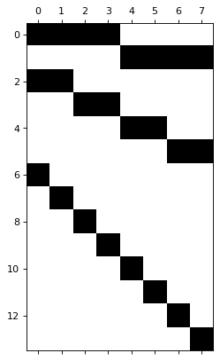

> Temporal Hierarchical Forecasting on Australian Tourism Data

In many applications, a set of time series is hierarchically organized.
Examples include the presence of geographic levels, products, or
categories that define different types of aggregations. In such
scenarios, forecasters are often required to provide predictions for all
disaggregate and aggregate series. A natural desire is for those
predictions to be **“coherent”**, that is, for the bottom series to add
up precisely to the forecasts of the aggregated series.

In this notebook we present an example on how to use
`HierarchicalForecast` to produce coherent forecasts between temporal
levels. We will use the classic Australian Domestic Tourism (`Tourism`)
dataset, which contains monthly time series of the number of visitors to
each state of Australia.

We will first load the `Tourism` data and produce base forecasts using
an `AutoETS` model from `StatsForecast`. Then, we reconciliate the
forecasts with several reconciliation algorithms from
`HierarchicalForecast` according to a temporal hierarchy.

You can run these experiments using CPU or GPU with Google Colab.

<a href="https://colab.research.google.com/github/Nixtla/hierarchicalforecast/blob/main/nbs/examples/AustralianDomesticTourismTemporal.ipynb" target="_parent"></a>

```python
%%capture
!pip install hierarchicalforecast statsforecast
```

## 1. Load and Process Data

In this example we will use the
[Tourism](https://otexts.com/fpp3/tourism.html) dataset from the
[Forecasting: Principles and Practice](https://otexts.com/fpp3/) book.

The dataset only contains the time series at the lowest level, so we
need to create the time series for all hierarchies.

```python
import numpy as np
import pandas as pd
```


```python
Y_df = pd.read_csv('https://raw.githubusercontent.com/Nixtla/transfer-learning-time-series/main/datasets/tourism.csv')
Y_df = Y_df.rename({'Trips': 'y', 'Quarter': 'ds'}, axis=1)
Y_df.insert(0, 'Country', 'Australia')
Y_df = Y_df[['Country', 'Region', 'State', 'Purpose', 'ds', 'y']]
Y_df['ds'] = Y_df['ds'].str.replace(r'(\d+) (Q\d)', r'\1-\2', regex=True)
Y_df['ds'] = pd.PeriodIndex(Y_df["ds"], freq='Q').to_timestamp()
Y_df.head()
```

|     | Country   | Region   | State           | Purpose  | ds         | y          |
|-----|-----------|----------|-----------------|----------|------------|------------|
| 0   | Australia | Adelaide | South Australia | Business | 1998-01-01 | 135.077690 |
| 1   | Australia | Adelaide | South Australia | Business | 1998-04-01 | 109.987316 |
| 2   | Australia | Adelaide | South Australia | Business | 1998-07-01 | 166.034687 |
| 3   | Australia | Adelaide | South Australia | Business | 1998-10-01 | 127.160464 |
| 4   | Australia | Adelaide | South Australia | Business | 1999-01-01 | 137.448533 |

## 2. Temporal reconciliation

First, we add a `unique_id` to the data.

```python
Y_df["unique_id"] = Y_df["Country"] + "/" + Y_df["State"] + "/" + Y_df["Region"] + "/" + Y_df["Purpose"]
```

### 2a. Split Train/Test sets

We use the final two years (8 quarters) as test set. Consequently, our
forecast horizon=8.

```python
horizon = 8
```


```python
Y_test_df = Y_df.groupby("unique_id", as_index=False).tail(horizon)
Y_train_df = Y_df.drop(Y_test_df.index)
```

### 2a. Aggregating the dataset according to temporal hierarchy

We first define the temporal aggregation spec. The spec is a dictionary
in which the keys are the name of the aggregation and the value is the
amount of bottom-level timesteps that should be aggregated in that
aggregation. For example, `year` consists of `12` months, so we define a
key, value pair `"yearly":12`. We can do something similar for other
aggregations that we are interested in.

In this example, we choose a temporal aggregation of `year`,
`semiannual` and `quarter`. The bottom level timesteps have a quarterly
frequency.

```python
spec_temporal = {"year": 4, "semiannual": 2, "quarter": 1}
```

We next compute the temporally aggregated train- and test sets using the
`aggregate_temporal` function. Note that we have different aggregation
matrices `S` for the train- and test set, as the test set contains
temporal hierarchies that are not included in the train set.

```python
from hierarchicalforecast.utils import aggregate_temporal
```


```python
Y_train_df, S_train_df, tags_train = aggregate_temporal(df=Y_train_df, spec=spec_temporal)
Y_test_df, S_test_df, tags_test = aggregate_temporal(df=Y_test_df,  spec=spec_temporal)

```


```python
tags_train
```

``` text
{'year': array(['year-1', 'year-2', 'year-3', 'year-4', 'year-5', 'year-6',
        'year-7', 'year-8', 'year-9', 'year-10', 'year-11', 'year-12',
        'year-13', 'year-14', 'year-15', 'year-16', 'year-17', 'year-18'],
       dtype=object),
 'semiannual': array(['semiannual-1', 'semiannual-2', 'semiannual-3', 'semiannual-4',
        'semiannual-5', 'semiannual-6', 'semiannual-7', 'semiannual-8',
        'semiannual-9', 'semiannual-10', 'semiannual-11', 'semiannual-12',
        'semiannual-13', 'semiannual-14', 'semiannual-15', 'semiannual-16',
        'semiannual-17', 'semiannual-18', 'semiannual-19', 'semiannual-20',
        'semiannual-21', 'semiannual-22', 'semiannual-23', 'semiannual-24',
        'semiannual-25', 'semiannual-26', 'semiannual-27', 'semiannual-28',
        'semiannual-29', 'semiannual-30', 'semiannual-31', 'semiannual-32',
        'semiannual-33', 'semiannual-34', 'semiannual-35', 'semiannual-36'],
       dtype=object),
 'quarter': array(['quarter-1', 'quarter-2', 'quarter-3', 'quarter-4', 'quarter-5',
        'quarter-6', 'quarter-7', 'quarter-8', 'quarter-9', 'quarter-10',
        'quarter-11', 'quarter-12', 'quarter-13', 'quarter-14',
        'quarter-15', 'quarter-16', 'quarter-17', 'quarter-18',
        'quarter-19', 'quarter-20', 'quarter-21', 'quarter-22',
        'quarter-23', 'quarter-24', 'quarter-25', 'quarter-26',
        'quarter-27', 'quarter-28', 'quarter-29', 'quarter-30',
        'quarter-31', 'quarter-32', 'quarter-33', 'quarter-34',
        'quarter-35', 'quarter-36', 'quarter-37', 'quarter-38',
        'quarter-39', 'quarter-40', 'quarter-41', 'quarter-42',
        'quarter-43', 'quarter-44', 'quarter-45', 'quarter-46',
        'quarter-47', 'quarter-48', 'quarter-49', 'quarter-50',
        'quarter-51', 'quarter-52', 'quarter-53', 'quarter-54',
        'quarter-55', 'quarter-56', 'quarter-57', 'quarter-58',
        'quarter-59', 'quarter-60', 'quarter-61', 'quarter-62',
        'quarter-63', 'quarter-64', 'quarter-65', 'quarter-66',
        'quarter-67', 'quarter-68', 'quarter-69', 'quarter-70',
        'quarter-71', 'quarter-72'], dtype=object)}
```

Our aggregation matrices aggregate the lowest temporal granularity
(quarters) up to years.

```python
S_train_df.iloc[:5, :5]
```

|     | temporal_id | quarter-1 | quarter-2 | quarter-3 | quarter-4 |
|-----|-------------|-----------|-----------|-----------|-----------|
| 0   | year-1      | 1.0       | 1.0       | 1.0       | 1.0       |
| 1   | year-2      | 0.0       | 0.0       | 0.0       | 0.0       |
| 2   | year-3      | 0.0       | 0.0       | 0.0       | 0.0       |
| 3   | year-4      | 0.0       | 0.0       | 0.0       | 0.0       |
| 4   | year-5      | 0.0       | 0.0       | 0.0       | 0.0       |

```python
S_test_df.iloc[:5, :5]
```

|     | temporal_id  | quarter-1 | quarter-2 | quarter-3 | quarter-4 |
|-----|--------------|-----------|-----------|-----------|-----------|
| 0   | year-1       | 1.0       | 1.0       | 1.0       | 1.0       |
| 1   | year-2       | 0.0       | 0.0       | 0.0       | 0.0       |
| 2   | semiannual-1 | 1.0       | 1.0       | 0.0       | 0.0       |
| 3   | semiannual-2 | 0.0       | 0.0       | 1.0       | 1.0       |
| 4   | semiannual-3 | 0.0       | 0.0       | 0.0       | 0.0       |

If you don’t have a test set available, as is usually the case when
you’re making forecasts, it is necessary to create a future dataframe
that holds the correct bottom-level unique_ids and timestamps so that
they can be temporally aggregated. We can use the
`make_future_dataframe` helper function for that.

```python
from hierarchicalforecast.utils import make_future_dataframe
```


```python
Y_test_df_new = make_future_dataframe(Y_train_df, freq="QS", h=horizon)
```

`Y_test_df_new` can be then used in `aggregate_temporal` to construct
the temporally aggregated structures:

```python
Y_test_df_new, S_test_df_new, tags_test_new = aggregate_temporal(df=Y_test_df_new,  spec=spec_temporal)
```

And we can verify that we have the same temporally aggregated test set,
except that `Y_test_df_new` doesn’t contain the ground truth values `y`.

```python
S_test_df_new
```

|     | temporal_id  | quarter-1 | quarter-2 | quarter-3 | quarter-4 | quarter-5 | quarter-6 | quarter-7 | quarter-8 |
|-----|--------------|-----------|-----------|-----------|-----------|-----------|-----------|-----------|-----------|
| 0   | year-1       | 1.0       | 1.0       | 1.0       | 1.0       | 0.0       | 0.0       | 0.0       | 0.0       |
| 1   | year-2       | 0.0       | 0.0       | 0.0       | 0.0       | 1.0       | 1.0       | 1.0       | 1.0       |
| 2   | semiannual-1 | 1.0       | 1.0       | 0.0       | 0.0       | 0.0       | 0.0       | 0.0       | 0.0       |
| 3   | semiannual-2 | 0.0       | 0.0       | 1.0       | 1.0       | 0.0       | 0.0       | 0.0       | 0.0       |
| 4   | semiannual-3 | 0.0       | 0.0       | 0.0       | 0.0       | 1.0       | 1.0       | 0.0       | 0.0       |
| 5   | semiannual-4 | 0.0       | 0.0       | 0.0       | 0.0       | 0.0       | 0.0       | 1.0       | 1.0       |
| 6   | quarter-1    | 1.0       | 0.0       | 0.0       | 0.0       | 0.0       | 0.0       | 0.0       | 0.0       |
| 7   | quarter-2    | 0.0       | 1.0       | 0.0       | 0.0       | 0.0       | 0.0       | 0.0       | 0.0       |
| 8   | quarter-3    | 0.0       | 0.0       | 1.0       | 0.0       | 0.0       | 0.0       | 0.0       | 0.0       |
| 9   | quarter-4    | 0.0       | 0.0       | 0.0       | 1.0       | 0.0       | 0.0       | 0.0       | 0.0       |
| 10  | quarter-5    | 0.0       | 0.0       | 0.0       | 0.0       | 1.0       | 0.0       | 0.0       | 0.0       |
| 11  | quarter-6    | 0.0       | 0.0       | 0.0       | 0.0       | 0.0       | 1.0       | 0.0       | 0.0       |
| 12  | quarter-7    | 0.0       | 0.0       | 0.0       | 0.0       | 0.0       | 0.0       | 1.0       | 0.0       |
| 13  | quarter-8    | 0.0       | 0.0       | 0.0       | 0.0       | 0.0       | 0.0       | 0.0       | 1.0       |

```python
Y_test_df
```

|      | temporal_id | unique_id                                         | ds         | y          |
|------|-------------|---------------------------------------------------|------------|------------|
| 0    | year-1      | Australia/ACT/Canberra/Business                   | 2016-10-01 | 754.139245 |
| 1    | year-2      | Australia/ACT/Canberra/Business                   | 2017-10-01 | 809.950839 |
| 2    | year-1      | Australia/ACT/Canberra/Holiday                    | 2016-10-01 | 735.365896 |
| 3    | year-2      | Australia/ACT/Canberra/Holiday                    | 2017-10-01 | 834.717900 |
| 4    | year-1      | Australia/ACT/Canberra/Other                      | 2016-10-01 | 175.239916 |
| ...  | ...         | ...                                               | ...        | ...        |
| 4251 | quarter-4   | Australia/Western Australia/Experience Perth/V... | 2016-10-01 | 439.699451 |
| 4252 | quarter-5   | Australia/Western Australia/Experience Perth/V... | 2017-01-01 | 356.867038 |
| 4253 | quarter-6   | Australia/Western Australia/Experience Perth/V... | 2017-04-01 | 302.296119 |
| 4254 | quarter-7   | Australia/Western Australia/Experience Perth/V... | 2017-07-01 | 373.442070 |
| 4255 | quarter-8   | Australia/Western Australia/Experience Perth/V... | 2017-10-01 | 455.316702 |

```python
Y_test_df_new
```

|      | temporal_id | unique_id                                         | ds         |
|------|-------------|---------------------------------------------------|------------|
| 0    | year-1      | Australia/ACT/Canberra/Business                   | 2016-10-01 |
| 1    | year-2      | Australia/ACT/Canberra/Business                   | 2017-10-01 |
| 2    | year-1      | Australia/ACT/Canberra/Holiday                    | 2016-10-01 |
| 3    | year-2      | Australia/ACT/Canberra/Holiday                    | 2017-10-01 |
| 4    | year-1      | Australia/ACT/Canberra/Other                      | 2016-10-01 |
| ...  | ...         | ...                                               | ...        |
| 4251 | quarter-4   | Australia/Western Australia/Experience Perth/V... | 2016-10-01 |
| 4252 | quarter-5   | Australia/Western Australia/Experience Perth/V... | 2017-01-01 |
| 4253 | quarter-6   | Australia/Western Australia/Experience Perth/V... | 2017-04-01 |
| 4254 | quarter-7   | Australia/Western Australia/Experience Perth/V... | 2017-07-01 |
| 4255 | quarter-8   | Australia/Western Australia/Experience Perth/V... | 2017-10-01 |

### 3b. Computing base forecasts

Now, we need to compute base forecasts for each temporal aggregation.
The following cell computes the **base forecasts** for each temporal
aggregation in `Y_train_df` using the `AutoETS` model. Observe that
`Y_hat_df` contains the forecasts but they are not coherent.

Note also that both frequency and horizon are different for each
temporal aggregation. In this example, the lowest level has a quarterly
frequency, and a horizon of `8` (constituting `2` years). The `year`
aggregation thus has a yearly frequency with a horizon of `2`.

It is of course possible to choose a different model for each level in
the temporal aggregation - you can be as creative as you like!

```python
from statsforecast.models import AutoETS
from statsforecast.core import StatsForecast
```


```python
Y_hat_dfs = []
id_cols = ["unique_id", "temporal_id", "ds", "y"]
# We will train a model for each temporal level
for level, temporal_ids_train in tags_train.items():
    # Filter the data for the level
    Y_level_train = Y_train_df.query("temporal_id in @temporal_ids_train")
    temporal_ids_test = tags_test[level]
    Y_level_test = Y_test_df.query("temporal_id in @temporal_ids_test")
    # For each temporal level we have a different frequency and forecast horizon
    freq_level = pd.infer_freq(Y_level_train["ds"].unique())
    horizon_level = Y_level_test["ds"].nunique()
    # Train a model and create forecasts
    fcst = StatsForecast(models=[AutoETS(model='ZZZ')], freq=freq_level, n_jobs=-1)
    Y_hat_df_level = fcst.forecast(df=Y_level_train[["ds", "unique_id", "y"]], h=horizon_level, level=[80, 90])
    # Add the test set to the forecast
    Y_hat_df_level = Y_hat_df_level.merge(Y_level_test, on=["ds", "unique_id"], how="left")
    # Put cols in the right order (for readability)
    Y_hat_cols = id_cols + [col for col in Y_hat_df_level.columns if col not in id_cols]
    Y_hat_df_level = Y_hat_df_level[Y_hat_cols]
    # Append the forecast to the list
    Y_hat_dfs.append(Y_hat_df_level)

Y_hat_df = pd.concat(Y_hat_dfs, ignore_index=True)

```

### 3c. Reconcile forecasts

We can use the `HierarchicalReconciliation` class to reconcile the
forecasts. In this example we use `BottomUp` and `MinTrace`. Note that
we have to set `temporal=True` in the `reconcile` function.

Note that temporal reconcilation currently isn’t supported for insample
reconciliation methods, such as `MinTrace(method='mint_shrink')`.

```python
from hierarchicalforecast.methods import BottomUp, MinTrace
from hierarchicalforecast.core import HierarchicalReconciliation
```


```python
reconcilers = [
    BottomUp(),
    MinTrace(method="ols"),
]
hrec = HierarchicalReconciliation(reconcilers=reconcilers)
Y_rec_df = hrec.reconcile(Y_hat_df=Y_hat_df, 
                          S_df=S_test_df, 
                          tags=tags_test, 
                          temporal=True, 
                          level=[80, 90])
```

## 4. Evaluation

The `HierarchicalForecast` package includes the `evaluate` function to
evaluate the different hierarchies.

We evaluate the temporally aggregated forecasts *across all temporal
aggregations*.

```python
from hierarchicalforecast.evaluation import evaluate
from utilsforecast.losses import mae, scaled_crps
```


```python
evaluation = evaluate(df = Y_rec_df.drop(columns = 'unique_id'),
                      tags = tags_test,
                      metrics = [mae, scaled_crps],
                      level = [80, 90],
                      id_col='temporal_id')

evaluation.columns = ['level', 'metric', 'Base', 'BottomUp', 'MinTrace(ols)']
numeric_cols = evaluation.select_dtypes(include="number").columns
evaluation[numeric_cols] = evaluation[numeric_cols].map('{:.3}'.format).astype(np.float64)
```


```python
evaluation
```

|     | level      | metric      | Base    | BottomUp | MinTrace(ols) |
|-----|------------|-------------|---------|----------|---------------|
| 0   | year       | mae         | 47.0000 | 50.8000  | 46.7000       |
| 1   | year       | scaled_crps | 0.0562  | 0.0620   | 0.0666        |
| 2   | semiannual | mae         | 29.5000 | 30.5000  | 29.1000       |
| 3   | semiannual | scaled_crps | 0.0643  | 0.0681   | 0.0727        |
| 4   | quarter    | mae         | 19.4000 | 19.4000  | 18.7000       |
| 5   | quarter    | scaled_crps | 0.0876  | 0.0876   | 0.0864        |
| 6   | Overall    | mae         | 26.2000 | 27.1000  | 25.7000       |
| 7   | Overall    | scaled_crps | 0.0765  | 0.0784   | 0.0797        |

`MinTrace(ols)` is the best overall point method, scoring the lowest
`mae` on the `year` and `semiannual` aggregated forecasts as well as the
`quarter` bottom-level aggregated forecasts. However, the `Base` method
is better overall on the probabilistic measure `crps`, where it scores
the lowest, indicating that the uncertainty levels predicted with the
`Base` method are better in this example.

## Appendix: plotting the S matrix

```python
from hierarchicalforecast.utils import HierarchicalPlot
```

We plot our summing matrix for the test set. It’s fairly
straightforward: there are two years in the test set, consisting of 4
quarters each. \* The first row of the `S` matrix shows how the
aggregation `2016` can be obtained by summing the 4 quarters in 2016. \*
The second row of the `S` matrix shows how the aggregation `2017` can be
obtained by summing the 4 quarters in 2017. \* The next 4 rows show how
the semi-annual aggregations can be obtained. \* The final rows are the
identity matrix for each quarter, denoting the bottom temporal level
(each quarter).

```python
hplot = HierarchicalPlot(S=S_test_df, tags=tags_test, S_id_col="temporal_id")
hplot.plot_summing_matrix()
```



