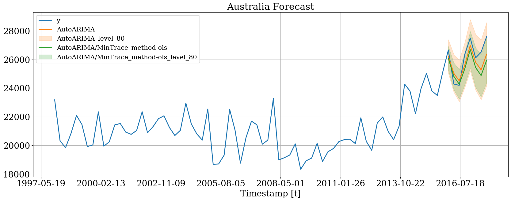
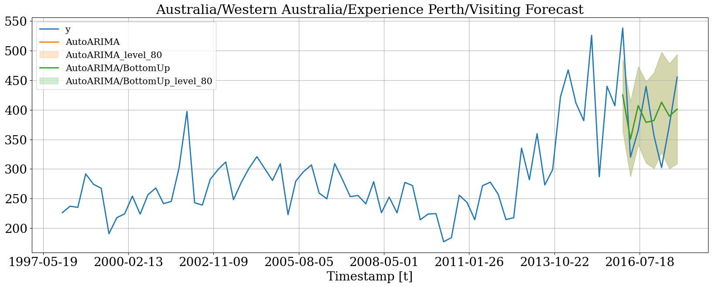
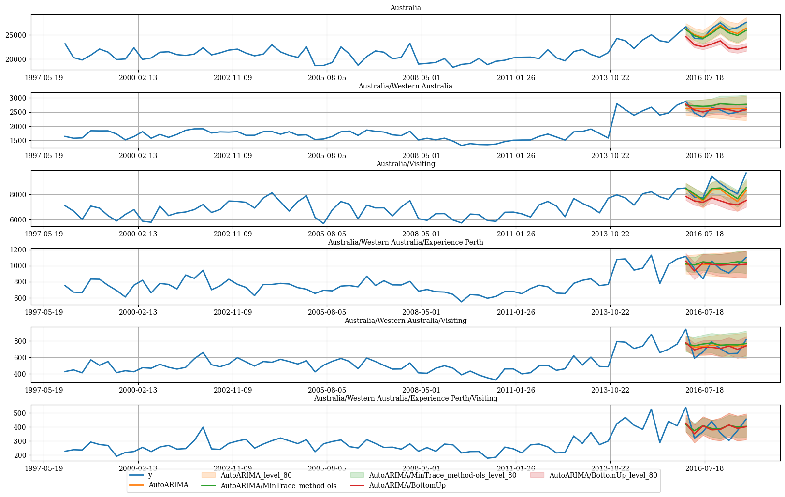
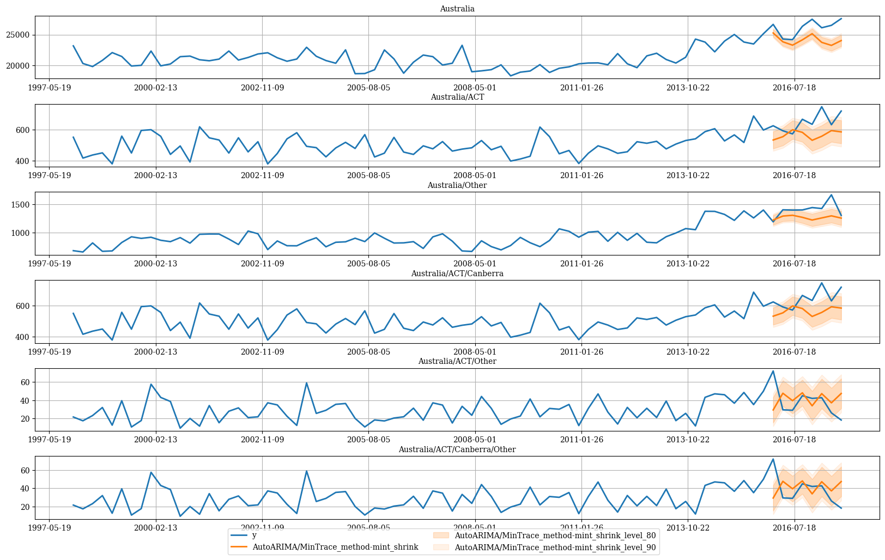

<a href="https://colab.research.google.com/github/Nixtla/hierarchicalforecast/blob/main/nbs/examples/AustralianDomesticTourism-Intervals.ipynb" target="_parent"></a>

In many cases, only the time series at the lowest level of the
hierarchies (bottom time series) are available. `HierarchicalForecast`
has tools to create time series for all hierarchies and also allows you
to calculate prediction intervals for all hierarchies. In this notebook
we will see how to do it.

```python
!pip install hierarchicalforecast statsforecast
```


```python
import pandas as pd

# compute base forecast no coherent
from statsforecast.models import AutoARIMA
from statsforecast.core import StatsForecast

#obtain hierarchical reconciliation methods and evaluation
from hierarchicalforecast.methods import BottomUp, MinTrace
from hierarchicalforecast.utils import aggregate, HierarchicalPlot
from hierarchicalforecast.core import HierarchicalReconciliation
```

## Aggregate bottom time series

In this example we will use the
[Tourism](https://otexts.com/fpp3/tourism.html) dataset from the
[Forecasting: Principles and Practice](https://otexts.com/fpp3/) book.
The dataset only contains the time series at the lowest level, so we
need to create the time series for all hierarchies.

```python
Y_df = pd.read_csv('https://raw.githubusercontent.com/Nixtla/transfer-learning-time-series/main/datasets/tourism.csv')
Y_df = Y_df.rename({'Trips': 'y', 'Quarter': 'ds'}, axis=1)
Y_df.insert(0, 'Country', 'Australia')
Y_df = Y_df[['Country', 'Region', 'State', 'Purpose', 'ds', 'y']]
Y_df['ds'] = Y_df['ds'].str.replace(r'(\d+) (Q\d)', r'\1-\2', regex=True)
Y_df['ds'] = pd.PeriodIndex(Y_df["ds"], freq='Q').to_timestamp()
Y_df.head()
```

|     | Country   | Region   | State           | Purpose  | ds         | y          |
|-----|-----------|----------|-----------------|----------|------------|------------|
| 0   | Australia | Adelaide | South Australia | Business | 1998-01-01 | 135.077690 |
| 1   | Australia | Adelaide | South Australia | Business | 1998-04-01 | 109.987316 |
| 2   | Australia | Adelaide | South Australia | Business | 1998-07-01 | 166.034687 |
| 3   | Australia | Adelaide | South Australia | Business | 1998-10-01 | 127.160464 |
| 4   | Australia | Adelaide | South Australia | Business | 1999-01-01 | 137.448533 |

The dataset can be grouped in the following non-strictly hierarchical
structure.

```python
spec = [
    ['Country'],
    ['Country', 'State'], 
    ['Country', 'Purpose'], 
    ['Country', 'State', 'Region'], 
    ['Country', 'State', 'Purpose'], 
    ['Country', 'State', 'Region', 'Purpose']
]
```

Using the `aggregate` function from `HierarchicalForecast` we can
generate: 1. `Y_df`: the hierarchical structured series
$\mathbf{y}_{[a,b]\tau}$ 2. `S_df`: the aggregation constraings
dataframe with $S_{[a,b]}$ 3. `tags`: a list with the ‘unique_ids’
conforming each aggregation level.

```python
Y_df, S_df, tags = aggregate(df=Y_df, spec=spec)
```


```python
Y_df.head()
```

|     | unique_id | ds         | y            |
|-----|-----------|------------|--------------|
| 0   | Australia | 1998-01-01 | 23182.197269 |
| 1   | Australia | 1998-04-01 | 20323.380067 |
| 2   | Australia | 1998-07-01 | 19826.640511 |
| 3   | Australia | 1998-10-01 | 20830.129891 |
| 4   | Australia | 1999-01-01 | 22087.353380 |

```python
S_df.iloc[:5, :5]
```

|     | unique_id                    | Australia/ACT/Canberra/Business | Australia/ACT/Canberra/Holiday | Australia/ACT/Canberra/Other | Australia/ACT/Canberra/Visiting |
|-----|------------------------------|---------------------------------|--------------------------------|------------------------------|---------------------------------|
| 0   | Australia                    | 1.0                             | 1.0                            | 1.0                          | 1.0                             |
| 1   | Australia/ACT                | 1.0                             | 1.0                            | 1.0                          | 1.0                             |
| 2   | Australia/New South Wales    | 0.0                             | 0.0                            | 0.0                          | 0.0                             |
| 3   | Australia/Northern Territory | 0.0                             | 0.0                            | 0.0                          | 0.0                             |
| 4   | Australia/Queensland         | 0.0                             | 0.0                            | 0.0                          | 0.0                             |

```python
tags['Country/Purpose']
```

``` text
array(['Australia/Business', 'Australia/Holiday', 'Australia/Other',
       'Australia/Visiting'], dtype=object)
```

We can visualize the `S` matrix and the data using the
`HierarchicalPlot` class as follows.

```python
hplot = HierarchicalPlot(S=S_df, tags=tags)
```


```python
hplot.plot_summing_matrix()
```


```python
hplot.plot_hierarchically_linked_series(
    bottom_series='Australia/ACT/Canberra/Holiday',
    Y_df=Y_df
)
```


### Split Train/Test sets

We use the final two years (8 quarters) as test set.

```python
Y_test_df = Y_df.groupby('unique_id', as_index=False).tail(8)
Y_train_df = Y_df.drop(Y_test_df.index)
```


```python
Y_train_df.groupby('unique_id').size()
```

``` text
unique_id
Australia                                                72
Australia/ACT                                            72
Australia/ACT/Business                                   72
Australia/ACT/Canberra                                   72
Australia/ACT/Canberra/Business                          72
                                                         ..
Australia/Western Australia/Experience Perth/Other       72
Australia/Western Australia/Experience Perth/Visiting    72
Australia/Western Australia/Holiday                      72
Australia/Western Australia/Other                        72
Australia/Western Australia/Visiting                     72
Length: 425, dtype: int64
```

## Computing base forecasts

The following cell computes the **base forecasts** for each time series
in `Y_df` using the `AutoARIMA` and model. Observe that `Y_hat_df`
contains the forecasts but they are not coherent. To reconcile the
prediction intervals we need to calculate the uncoherent intervals using
the `level` argument of `StatsForecast`.

```python
fcst = StatsForecast(models=[AutoARIMA(season_length=4)], 
                     freq='QS', n_jobs=-1)
Y_hat_df = fcst.forecast(df=Y_train_df, h=8, fitted=True, level=[80, 90])
Y_fitted_df = fcst.forecast_fitted_values()
```

## Reconcile forecasts

The following cell makes the previous forecasts coherent using the
`HierarchicalReconciliation` class. Since the hierarchy structure is not
strict, we can’t use methods such as `TopDown` or `MiddleOut`. In this
example we use `BottomUp` and `MinTrace`. If you want to calculate
prediction intervals, you have to use the `level` argument as follows.

```python
reconcilers = [
    BottomUp(),
    MinTrace(method='mint_shrink'),
    MinTrace(method='ols')
]
hrec = HierarchicalReconciliation(reconcilers=reconcilers)
Y_rec_df = hrec.reconcile(Y_hat_df=Y_hat_df, Y_df=Y_fitted_df, 
                          S_df=S_df, tags=tags, level=[80, 90])
```

The dataframe `Y_rec_df` contains the reconciled forecasts.

```python
Y_rec_df.head()
```

|     | unique_id | ds         | AutoARIMA    | AutoARIMA-lo-90 | AutoARIMA-lo-80 | AutoARIMA-hi-80 | AutoARIMA-hi-90 | AutoARIMA/BottomUp | AutoARIMA/BottomUp-lo-90 | AutoARIMA/BottomUp-lo-80 | ... | AutoARIMA/MinTrace_method-mint_shrink | AutoARIMA/MinTrace_method-mint_shrink-lo-90 | AutoARIMA/MinTrace_method-mint_shrink-lo-80 | AutoARIMA/MinTrace_method-mint_shrink-hi-80 | AutoARIMA/MinTrace_method-mint_shrink-hi-90 | AutoARIMA/MinTrace_method-ols | AutoARIMA/MinTrace_method-ols-lo-90 | AutoARIMA/MinTrace_method-ols-lo-80 | AutoARIMA/MinTrace_method-ols-hi-80 | AutoARIMA/MinTrace_method-ols-hi-90 |
|-----|-----------|------------|--------------|-----------------|-----------------|-----------------|-----------------|--------------------|--------------------------|--------------------------|-----|---------------------------------------|---------------------------------------------|---------------------------------------------|---------------------------------------------|---------------------------------------------|-------------------------------|-------------------------------------|-------------------------------------|-------------------------------------|-------------------------------------|
| 0   | Australia | 2016-01-01 | 26212.553553 | 24705.948180    | 25038.715077    | 27386.392029    | 27719.158927    | 24646.517084       | 23983.656843             | 24130.064091             | ... | 25267.797338                          | 24491.630618                                | 24663.064091                                | 25872.530586                                | 26043.964058                                | 26082.753488                  | 25010.876141                        | 25247.623803                        | 26917.883174                        | 27154.630835                        |
| 1   | Australia | 2016-04-01 | 25033.667125 | 23337.267588    | 23711.954696    | 26355.379554    | 26730.066662    | 22942.957703       | 22229.916838             | 22387.407579             | ... | 23836.804444                          | 23002.620214                                | 23186.868128                                | 24486.740760                                | 24670.988674                                | 24822.102094                  | 23616.734393                        | 23882.966332                        | 25761.237857                        | 26027.469796                        |
| 2   | Australia | 2016-07-01 | 24507.027198 | 22640.028798    | 23052.396413    | 25961.657983    | 26374.025599    | 22568.286488       | 21805.892199             | 21974.283728             | ... | 23294.240908                          | 22410.719833                                | 22605.864873                                | 23982.616942                                | 24177.761983                                | 24269.578724                  | 22944.380043                        | 23237.079287                        | 25302.078162                        | 25594.777406                        |
| 3   | Australia | 2016-10-01 | 25598.928613 | 23575.665243    | 24022.547410    | 27175.309816    | 27622.191983    | 23113.075726       | 22308.671860             | 22486.342127             | ... | 24154.484487                          | 23221.706185                                | 23427.730766                                | 24881.238208                                | 25087.262790                                | 25340.549923                  | 23905.434070                        | 24222.410936                        | 26458.688911                        | 26775.665777                        |
| 4   | Australia | 2017-01-01 | 26982.576796 | 24669.535238    | 25180.421285    | 28784.732308    | 29295.618354    | 23779.264921       | 22874.194227             | 23074.098975             | ... | 25155.001372                          | 24125.268915                                | 24352.707952                                | 25957.294793                                | 26184.733830                                | 26690.200927                  | 25051.352698                        | 25413.328335                        | 27967.073518                        | 28329.049155                        |

## Plot forecasts

Then we can plot the probabilistic forecasts using the following
function.

```python
plot_df = Y_df.merge(Y_rec_df, on=['unique_id', 'ds'], how="outer")
```

### Plot single time series

```python
hplot.plot_series(
    series='Australia',
    Y_df=plot_df, 
    models=['y', 'AutoARIMA', 'AutoARIMA/MinTrace_method-ols'],
    level=[80]
)
```



```python
# Since we are plotting a bottom time series
# the probabilistic and mean forecasts
# are the same
hplot.plot_series(
    series='Australia/Western Australia/Experience Perth/Visiting',
    Y_df=plot_df, 
    models=['y', 'AutoARIMA', 'AutoARIMA/BottomUp'],
    level=[80]
)
```



### Plot hierarchichally linked time series

```python
hplot.plot_hierarchically_linked_series(
    bottom_series='Australia/Western Australia/Experience Perth/Visiting',
    Y_df=plot_df, 
    models=['y', 'AutoARIMA', 'AutoARIMA/MinTrace_method-ols', 'AutoARIMA/BottomUp'],
    level=[80]
)
```



```python
# ACT only has Canberra
hplot.plot_hierarchically_linked_series(
    bottom_series='Australia/ACT/Canberra/Other',
    Y_df=plot_df, 
    models=['y', 'AutoARIMA/MinTrace_method-mint_shrink'],
    level=[80, 90]
)
```



### References

-   [Hyndman, R.J., & Athanasopoulos, G. (2021). “Forecasting:
    principles and practice, 3rd edition: Chapter 11: Forecasting
    hierarchical and grouped series.”. OTexts: Melbourne, Australia.
    OTexts.com/fpp3 Accessed on July
    2022.](https://otexts.com/fpp3/hierarchical.html)
-   [Shanika L. Wickramasuriya, George Athanasopoulos, and Rob J.
    Hyndman. Optimal forecast reconciliation for hierarchical and
    grouped time series through trace minimization.Journal of the
    American Statistical Association, 114(526):804–819, 2019. doi:
    10.1080/01621459.2018.1448825. URL
    https://robjhyndman.com/publications/mint/.](https://robjhyndman.com/publications/mint/)

