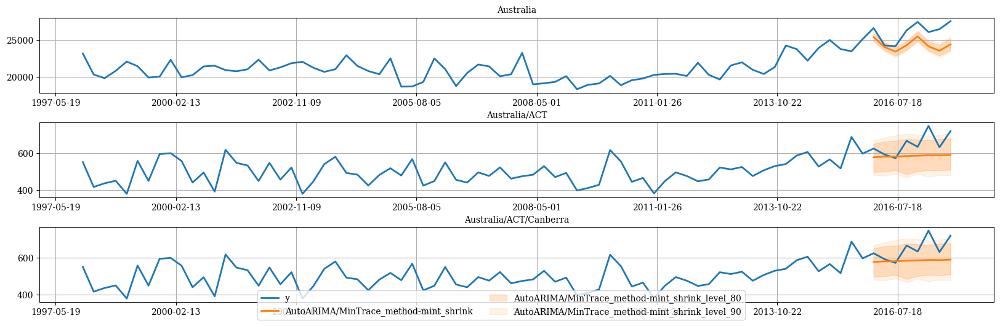

<a href="https://colab.research.google.com/github/Nixtla/hierarchicalforecast/blob/main/nbs/examples/AustralianDomesticTourism-Permbu-Intervals.ipynb" target="_parent"></a>

In many cases, only the time series at the lowest level of the
hierarchies (bottom time series) are available. `HierarchicalForecast`
has tools to create time series for all hierarchies and also allows you
to calculate prediction intervals for all hierarchies. In this notebook
we will see how to do it.

```python
!pip install hierarchicalforecast statsforecast
```


```python
import pandas as pd

# compute base forecast no coherent
from statsforecast.models import AutoARIMA
from statsforecast.core import StatsForecast

#obtain hierarchical reconciliation methods and evaluation
from hierarchicalforecast.methods import BottomUp, MinTrace
from hierarchicalforecast.utils import aggregate, HierarchicalPlot
from hierarchicalforecast.core import HierarchicalReconciliation
```

## Aggregate bottom time series

In this example we will use the
[Tourism](https://otexts.com/fpp3/tourism.html) dataset from the
[Forecasting: Principles and Practice](https://otexts.com/fpp3/) book.
The dataset only contains the time series at the lowest level, so we
need to create the time series for all hierarchies.

```python
Y_df = pd.read_csv('https://raw.githubusercontent.com/Nixtla/transfer-learning-time-series/main/datasets/tourism.csv')
Y_df = Y_df.rename({'Trips': 'y', 'Quarter': 'ds'}, axis=1)
Y_df.insert(0, 'Country', 'Australia')
Y_df = Y_df[['Country', 'Region', 'State', 'Purpose', 'ds', 'y']]
Y_df['ds'] = Y_df['ds'].str.replace(r'(\d+) (Q\d)', r'\1-\2', regex=True)
Y_df['ds'] = pd.PeriodIndex(Y_df["ds"], freq='Q').to_timestamp()
Y_df.head()
```

|     | Country   | Region   | State           | Purpose  | ds         | y          |
|-----|-----------|----------|-----------------|----------|------------|------------|
| 0   | Australia | Adelaide | South Australia | Business | 1998-01-01 | 135.077690 |
| 1   | Australia | Adelaide | South Australia | Business | 1998-04-01 | 109.987316 |
| 2   | Australia | Adelaide | South Australia | Business | 1998-07-01 | 166.034687 |
| 3   | Australia | Adelaide | South Australia | Business | 1998-10-01 | 127.160464 |
| 4   | Australia | Adelaide | South Australia | Business | 1999-01-01 | 137.448533 |

The dataset can be grouped in the following strictly hierarchical
structure.

```python
spec = [
    ['Country'],
    ['Country', 'State'], 
    ['Country', 'State', 'Region']
]
```

Using the `aggregate` function from `HierarchicalForecast` we can get
the full set of time series.

```python
Y_df, S_df, tags = aggregate(df=Y_df, spec=spec)
```


```python
Y_df.head()
```

|     | unique_id | ds         | y            |
|-----|-----------|------------|--------------|
| 0   | Australia | 1998-01-01 | 23182.197269 |
| 1   | Australia | 1998-04-01 | 20323.380067 |
| 2   | Australia | 1998-07-01 | 19826.640511 |
| 3   | Australia | 1998-10-01 | 20830.129891 |
| 4   | Australia | 1999-01-01 | 22087.353380 |

```python
S_df.iloc[:5, :5]
```

|     | unique_id                    | Australia/ACT/Canberra | Australia/New South Wales/Blue Mountains | Australia/New South Wales/Capital Country | Australia/New South Wales/Central Coast |
|-----|------------------------------|------------------------|------------------------------------------|-------------------------------------------|-----------------------------------------|
| 0   | Australia                    | 1.0                    | 1.0                                      | 1.0                                       | 1.0                                     |
| 1   | Australia/ACT                | 1.0                    | 0.0                                      | 0.0                                       | 0.0                                     |
| 2   | Australia/New South Wales    | 0.0                    | 1.0                                      | 1.0                                       | 1.0                                     |
| 3   | Australia/Northern Territory | 0.0                    | 0.0                                      | 0.0                                       | 0.0                                     |
| 4   | Australia/Queensland         | 0.0                    | 0.0                                      | 0.0                                       | 0.0                                     |

```python
tags['Country/State']
```

``` text
array(['Australia/ACT', 'Australia/New South Wales',
       'Australia/Northern Territory', 'Australia/Queensland',
       'Australia/South Australia', 'Australia/Tasmania',
       'Australia/Victoria', 'Australia/Western Australia'], dtype=object)
```

We can visualize the `S` matrix and the data using the
`HierarchicalPlot` class as follows.

```python
hplot = HierarchicalPlot(S=S_df, tags=tags)
```


```python
hplot.plot_summing_matrix()
```


```python
hplot.plot_hierarchically_linked_series(
    bottom_series='Australia/ACT/Canberra',
    Y_df=Y_df
)
```


### Split Train/Test sets

We use the final two years (8 quarters) as test set.

```python
Y_test_df = Y_df.groupby('unique_id', as_index=False).tail(8)
Y_train_df = Y_df.drop(Y_test_df.index)
```


```python
Y_train_df.groupby('unique_id').size()
```

``` text
unique_id
Australia                                                 72
Australia/ACT                                             72
Australia/ACT/Canberra                                    72
Australia/New South Wales                                 72
Australia/New South Wales/Blue Mountains                  72
                                                          ..
Australia/Western Australia/Australia's Coral Coast       72
Australia/Western Australia/Australia's Golden Outback    72
Australia/Western Australia/Australia's North West        72
Australia/Western Australia/Australia's South West        72
Australia/Western Australia/Experience Perth              72
Length: 85, dtype: int64
```

## Computing base forecasts

The following cell computes the **base forecasts** for each time series
in `Y_df` using the `AutoARIMA` and model. Observe that `Y_hat_df`
contains the forecasts but they are not coherent. To reconcile the
prediction intervals we need to calculate the uncoherent intervals using
the `level` argument of `StatsForecast`.

```python
fcst = StatsForecast(models=[AutoARIMA(season_length=4)], 
                     freq='QS', n_jobs=-1)
Y_hat_df = fcst.forecast(df=Y_train_df, h=8, fitted=True, level=[80, 90])
Y_fitted_df = fcst.forecast_fitted_values()
```

## Reconcile forecasts and compute prediction intervals using PERMBU

The following cell makes the previous forecasts coherent using the
`HierarchicalReconciliation` class. In this example we use `BottomUp`
and `MinTrace`. If you want to calculate prediction intervals, you have
to use the `level` argument as follows and also
`intervals_method='permbu'`.

```python
reconcilers = [
    BottomUp(),
    MinTrace(method='mint_shrink'),
    MinTrace(method='ols')
]
hrec = HierarchicalReconciliation(reconcilers=reconcilers)
Y_rec_df = hrec.reconcile(Y_hat_df=Y_hat_df, Y_df=Y_fitted_df,
                          S_df=S_df, tags=tags,
                          level=[80, 90], intervals_method='permbu')
```

The dataframe `Y_rec_df` contains the reconciled forecasts.

```python
Y_rec_df.head()
```

|     | unique_id | ds         | AutoARIMA    | AutoARIMA-lo-90 | AutoARIMA-lo-80 | AutoARIMA-hi-80 | AutoARIMA-hi-90 | AutoARIMA/BottomUp | AutoARIMA/BottomUp-lo-90 | AutoARIMA/BottomUp-lo-80 | ... | AutoARIMA/MinTrace_method-mint_shrink | AutoARIMA/MinTrace_method-mint_shrink-lo-90 | AutoARIMA/MinTrace_method-mint_shrink-lo-80 | AutoARIMA/MinTrace_method-mint_shrink-hi-80 | AutoARIMA/MinTrace_method-mint_shrink-hi-90 | AutoARIMA/MinTrace_method-ols | AutoARIMA/MinTrace_method-ols-lo-90 | AutoARIMA/MinTrace_method-ols-lo-80 | AutoARIMA/MinTrace_method-ols-hi-80 | AutoARIMA/MinTrace_method-ols-hi-90 |
|-----|-----------|------------|--------------|-----------------|-----------------|-----------------|-----------------|--------------------|--------------------------|--------------------------|-----|---------------------------------------|---------------------------------------------|---------------------------------------------|---------------------------------------------|---------------------------------------------|-------------------------------|-------------------------------------|-------------------------------------|-------------------------------------|-------------------------------------|
| 0   | Australia | 2016-01-01 | 26212.553553 | 24705.948180    | 25038.715077    | 27386.392029    | 27719.158927    | 24955.501571       | 24143.056131             | 24387.230200             | ... | 25413.657606                          | 24705.682710                                | 24905.677772                                | 25928.334367                                | 26050.232961                                | 26142.818016                  | 25525.081721                        | 25656.537995                        | 26606.345032                        | 26832.423921                        |
| 1   | Australia | 2016-04-01 | 25033.667125 | 23337.267588    | 23711.954696    | 26355.379554    | 26730.066662    | 23421.312868       | 22762.045247             | 22904.087197             | ... | 24058.906411                          | 23486.828548                                | 23627.152623                                | 24659.405484                                | 24847.778503                                | 24946.338649                  | 24297.061230                        | 24434.805048                        | 25535.549040                        | 25640.659918                        |
| 2   | Australia | 2016-07-01 | 24507.027198 | 22640.028798    | 23052.396413    | 25961.657983    | 26374.025599    | 22807.706826       | 22065.402373             | 22223.120404             | ... | 23438.863893                          | 22672.658701                                | 22888.299153                                | 23971.724733                                | 24179.548677                                | 24407.245003                  | 23712.841797                        | 23834.054327                        | 25027.073615                        | 25189.869286                        |
| 3   | Australia | 2016-10-01 | 25598.928613 | 23575.665243    | 24022.547410    | 27175.309816    | 27622.191983    | 23471.845870       | 22677.593575             | 22892.328939             | ... | 24322.049398                          | 23619.419712                                | 23682.803746                                | 24847.299228                                | 25028.345572                                | 25496.855604                  | 24740.210465                        | 24923.560783                        | 26094.250414                        | 26273.617732                        |
| 4   | Australia | 2017-01-01 | 26982.576796 | 24669.535238    | 25180.421285    | 28784.732308    | 29295.618354    | 24668.735931       | 23760.842072             | 23964.283124             | ... | 25520.163549                          | 24720.304392                                | 24910.106650                                | 26170.552678                                | 26347.181903                                | 26853.231907                  | 26045.213677                        | 26149.753374                        | 27502.499674                        | 27733.985566                        |

## Plot forecasts

Then we can plot the probabilist forecasts using the following function.

```python
plot_df = Y_df.merge(Y_rec_df, on=['unique_id', 'ds'], how="outer")
```

### Plot single time series

```python
hplot.plot_series(
    series='Australia',
    Y_df=plot_df, 
    models=['y', 'AutoARIMA', 
            'AutoARIMA/MinTrace_method-ols',
            'AutoARIMA/BottomUp'
           ],
    level=[80]
)
```


### Plot hierarchichally linked time series

```python
hplot.plot_hierarchically_linked_series(
    bottom_series='Australia/Western Australia/Experience Perth',
    Y_df=plot_df, 
    models=['y', 'AutoARIMA', 'AutoARIMA/MinTrace_method-ols', 'AutoARIMA/BottomUp'],
    level=[80]
)
```


```python
# ACT only has Canberra
hplot.plot_hierarchically_linked_series(
    bottom_series='Australia/ACT/Canberra',
    Y_df=plot_df, 
    models=['y', 'AutoARIMA/MinTrace_method-mint_shrink'],
    level=[80, 90]
)
```



### References

-   [Hyndman, R.J., & Athanasopoulos, G. (2021). “Forecasting:
    principles and practice, 3rd edition: Chapter 11: Forecasting
    hierarchical and grouped series.”. OTexts: Melbourne, Australia.
    OTexts.com/fpp3 Accessed on July
    2022.](https://otexts.com/fpp3/hierarchical.html)
-   [Shanika L. Wickramasuriya, George Athanasopoulos, and Rob J.
    Hyndman. Optimal forecast reconciliation for hierarchical and
    grouped time series through trace minimization.Journal of the
    American Statistical Association, 114(526):804–819, 2019. doi:
    10.1080/01621459.2018.1448825. URL
    https://robjhyndman.com/publications/mint/.](https://robjhyndman.com/publications/mint/)

