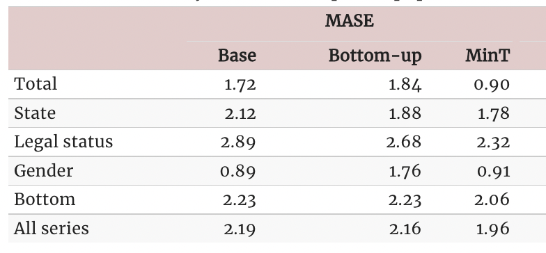

In many applications, a set of time series is hierarchically organized.
Examples include the presence of geographic levels, products, or
categories that define different types of aggregations. In such
scenarios, forecasters are often required to provide predictions for all
disaggregate and aggregate series. A natural desire is for those
predictions to be **“coherent”**, that is, for the bottom series to add
up precisely to the forecasts of the aggregated series.

In this notebook we present an example on how to use
`HierarchicalForecast` to produce coherent forecasts between
geographical levels. We will use the Australian Prison Population
dataset.

We will first load the dataset and produce base forecasts using an `ETS`
model from `StatsForecast`, and then reconciliate the forecasts with
several reconciliation algorithms from `HierarchicalForecast`. Finally,
we show the performance is comparable with the results reported by the
[Forecasting: Principles and
Practice](https://otexts.com/fpp3/tourism.html) which uses the R package
[fable](https://github.com/tidyverts/fable).

You can run these experiments using CPU or GPU with Google Colab.

<a href="https://colab.research.google.com/github/Nixtla/hierarchicalforecast/blob/main/nbs/examples/AustralianPrisonPopulation.ipynb" target="_parent"></a>

```python
!pip install hierarchicalforecast
!pip install -U statsforecast numba
```

## 1. Load and Process Data

The dataset only contains the time series at the lowest level, so we
need to create the time series for all hierarchies.

```python
import numpy as np
import pandas as pd
```


```python
Y_df = pd.read_csv('https://OTexts.com/fpp3/extrafiles/prison_population.csv')
Y_df = Y_df.rename({'Count': 'y', 'Date': 'ds'}, axis=1)
Y_df.insert(0, 'Country', 'Australia')
Y_df = Y_df[['Country', 'State', 'Gender', 'Legal', 'Indigenous', 'ds', 'y']]
Y_df['ds'] = pd.to_datetime(Y_df['ds'])
Y_df.head()
```

|     | Country   | State | Gender | Legal     | Indigenous | ds         | y   |
|-----|-----------|-------|--------|-----------|------------|------------|-----|
| 0   | Australia | ACT   | Female | Remanded  | ATSI       | 2005-03-01 | 0   |
| 1   | Australia | ACT   | Female | Remanded  | Non-ATSI   | 2005-03-01 | 2   |
| 2   | Australia | ACT   | Female | Sentenced | ATSI       | 2005-03-01 | 0   |
| 3   | Australia | ACT   | Female | Sentenced | Non-ATSI   | 2005-03-01 | 5   |
| 4   | Australia | ACT   | Male   | Remanded  | ATSI       | 2005-03-01 | 7   |

The dataset can be grouped in the following grouped structure.

```python
hiers = [
    ['Country'],
    ['Country', 'State'], 
    ['Country', 'Gender'], 
    ['Country', 'Legal'], 
    ['Country', 'State', 'Gender', 'Legal']
]
```

Using the
[`aggregate`](https://Nixtla.github.io/hierarchicalforecast/utils.html#aggregate)
function from `HierarchicalForecast` we can get the full set of time
series.

```python
from hierarchicalforecast.utils import aggregate
```


```python
Y_df, S_df, tags = aggregate(Y_df, hiers)
Y_df['y'] = Y_df['y']/1e3
Y_df = Y_df.reset_index()
```


```python
Y_df.head()
```

|     | unique_id | ds         | y      |
|-----|-----------|------------|--------|
| 0   | Australia | 2005-03-01 | 24.296 |
| 1   | Australia | 2005-06-01 | 24.643 |
| 2   | Australia | 2005-09-01 | 24.511 |
| 3   | Australia | 2005-12-01 | 24.393 |
| 4   | Australia | 2006-03-01 | 24.524 |

```python
S_df.iloc[:5, :5]
```

|               | Australia/ACT/Female/Remanded | Australia/ACT/Female/Sentenced | Australia/ACT/Male/Remanded | Australia/ACT/Male/Sentenced | Australia/NSW/Female/Remanded |
|---------------|-------------------------------|--------------------------------|-----------------------------|------------------------------|-------------------------------|
| Australia     | 1.0                           | 1.0                            | 1.0                         | 1.0                          | 1.0                           |
| Australia/ACT | 1.0                           | 1.0                            | 1.0                         | 1.0                          | 0.0                           |
| Australia/NSW | 0.0                           | 0.0                            | 0.0                         | 0.0                          | 1.0                           |
| Australia/NT  | 0.0                           | 0.0                            | 0.0                         | 0.0                          | 0.0                           |
| Australia/QLD | 0.0                           | 0.0                            | 0.0                         | 0.0                          | 0.0                           |

```python
tags
```

``` text
{'Country': array(['Australia'], dtype=object),
 'Country/State': array(['Australia/ACT', 'Australia/NSW', 'Australia/NT', 'Australia/QLD',
        'Australia/SA', 'Australia/TAS', 'Australia/VIC', 'Australia/WA'],
       dtype=object),
 'Country/Gender': array(['Australia/Female', 'Australia/Male'], dtype=object),
 'Country/Legal': array(['Australia/Remanded', 'Australia/Sentenced'], dtype=object),
 'Country/State/Gender/Legal': ['Australia/ACT/Female/Remanded',
  'Australia/ACT/Female/Sentenced',
  'Australia/ACT/Male/Remanded',
  'Australia/ACT/Male/Sentenced',
  'Australia/NSW/Female/Remanded',
  'Australia/NSW/Female/Sentenced',
  'Australia/NSW/Male/Remanded',
  'Australia/NSW/Male/Sentenced',
  'Australia/NT/Female/Remanded',
  'Australia/NT/Female/Sentenced',
  'Australia/NT/Male/Remanded',
  'Australia/NT/Male/Sentenced',
  'Australia/QLD/Female/Remanded',
  'Australia/QLD/Female/Sentenced',
  'Australia/QLD/Male/Remanded',
  'Australia/QLD/Male/Sentenced',
  'Australia/SA/Female/Remanded',
  'Australia/SA/Female/Sentenced',
  'Australia/SA/Male/Remanded',
  'Australia/SA/Male/Sentenced',
  'Australia/TAS/Female/Remanded',
  'Australia/TAS/Female/Sentenced',
  'Australia/TAS/Male/Remanded',
  'Australia/TAS/Male/Sentenced',
  'Australia/VIC/Female/Remanded',
  'Australia/VIC/Female/Sentenced',
  'Australia/VIC/Male/Remanded',
  'Australia/VIC/Male/Sentenced',
  'Australia/WA/Female/Remanded',
  'Australia/WA/Female/Sentenced',
  'Australia/WA/Male/Remanded',
  'Australia/WA/Male/Sentenced']}
```

### Split Train/Test sets

We use the final two years (8 quarters) as test set.

```python
Y_test_df = Y_df.groupby('unique_id').tail(8)
Y_train_df = Y_df.drop(Y_test_df.index)
```


```python
Y_test_df = Y_test_df.set_index('unique_id')
Y_train_df = Y_train_df.set_index('unique_id')
```

## 2. Computing base forecasts

The following cell computes the **base forecasts** for each time series
in `Y_df` using the `ETS` model. Observe that `Y_hat_df` contains the
forecasts but they are not coherent.

```python
from statsforecast.models import ETS
from statsforecast.core import StatsForecast
```


```python
fcst = StatsForecast(df=Y_train_df,
                     models=[ETS(season_length=4, model='ZMZ')], 
                     freq='QS', n_jobs=-1)
Y_hat_df = fcst.forecast(h=8, fitted=True)
Y_fitted_df = fcst.forecast_fitted_values()
```

## 3. Reconcile forecasts

The following cell makes the previous forecasts coherent using the
[`HierarchicalReconciliation`](https://Nixtla.github.io/hierarchicalforecast/core.html#hierarchicalreconciliation)
class. Since the hierarchy structure is not strict, we can’t use methods
such as
[`TopDown`](https://Nixtla.github.io/hierarchicalforecast/methods.html#topdown)
or
[`MiddleOut`](https://Nixtla.github.io/hierarchicalforecast/methods.html#middleout).
In this example we use
[`BottomUp`](https://Nixtla.github.io/hierarchicalforecast/methods.html#bottomup)
and
[`MinTrace`](https://Nixtla.github.io/hierarchicalforecast/methods.html#mintrace).

```python
from hierarchicalforecast.methods import BottomUp, MinTrace
from hierarchicalforecast.core import HierarchicalReconciliation
```


```python
reconcilers = [
    BottomUp(),
    MinTrace(method='mint_shrink')
]
hrec = HierarchicalReconciliation(reconcilers=reconcilers)
Y_rec_df = hrec.reconcile(Y_hat_df=Y_hat_df, Y_df=Y_fitted_df, S=S_df, tags=tags)
```

The dataframe `Y_rec_df` contains the reconciled forecasts.

```python
Y_rec_df.head()
```

|           | ds         | ETS       | ETS/BottomUp | ETS/MinTrace_method-mint_shrink |
|-----------|------------|-----------|--------------|---------------------------------|
| unique_id |            |           |              |                                 |
| Australia | 2015-01-01 | 34.799496 | 34.933891    | 34.927244                       |
| Australia | 2015-04-01 | 35.192638 | 35.473560    | 35.440861                       |
| Australia | 2015-07-01 | 35.188217 | 35.687363    | 35.476427                       |
| Australia | 2015-10-01 | 35.888626 | 36.010685    | 35.946153                       |
| Australia | 2016-01-01 | 36.045437 | 36.400101    | 36.244707                       |

## 4. Evaluation

The `HierarchicalForecast` package includes the
[`HierarchicalEvaluation`](https://Nixtla.github.io/hierarchicalforecast/evaluation.html#hierarchicalevaluation)
class to evaluate the different hierarchies and also is capable of
compute scaled metrics compared to a benchmark model.

```python
from hierarchicalforecast.evaluation import HierarchicalEvaluation
```


```python
def mase(y, y_hat, y_insample, seasonality=4):
    errors = np.mean(np.abs(y - y_hat), axis=1)
    scale = np.mean(np.abs(y_insample[:, seasonality:] - y_insample[:, :-seasonality]), axis=1)
    return np.mean(errors / scale)

eval_tags = {}
eval_tags['Total'] = tags['Country']
eval_tags['State'] = tags['Country/State']
eval_tags['Legal status'] = tags['Country/Legal']
eval_tags['Gender'] = tags['Country/Gender']
eval_tags['Bottom'] = tags['Country/State/Gender/Legal']
eval_tags['All series'] = np.concatenate(list(tags.values()))

evaluator = HierarchicalEvaluation(evaluators=[mase])
evaluation = evaluator.evaluate(
    Y_hat_df=Y_rec_df, Y_test_df=Y_test_df,
    tags=eval_tags,
    Y_df=Y_train_df
)
evaluation = evaluation.reset_index().drop(columns='metric').drop(0).set_index('level')
evaluation.columns = ['Base', 'BottomUp', 'MinTrace(mint_shrink)']
evaluation.applymap('{:.2f}'.format)
```

|              | Base | BottomUp | MinTrace(mint_shrink) |
|--------------|------|----------|-----------------------|
| level        |      |          |                       |
| Total        | 1.36 | 1.02     | 1.16                  |
| State        | 1.54 | 1.57     | 1.61                  |
| Legal status | 2.40 | 2.50     | 2.40                  |
| Gender       | 1.08 | 0.81     | 0.95                  |
| Bottom       | 2.17 | 2.17     | 2.16                  |
| All series   | 2.00 | 2.00     | 2.00                  |

### Fable Comparison

Observe that we can recover the results reported by the [Forecasting:
Principles and Practice](https://otexts.com/fpp3/prison.html) book. The
original results were calculated using the R package
[fable](https://github.com/tidyverts/fable).

<figure>

<figcaption aria-hidden="true">Fable’s reconciliation
results</figcaption>
</figure>

### References

-   [Hyndman, R.J., & Athanasopoulos, G. (2021). “Forecasting:
    principles and practice, 3rd edition: Chapter 11: Forecasting
    hierarchical and grouped series.”. OTexts: Melbourne, Australia.
    OTexts.com/fpp3 Accessed on July
    2022.](https://otexts.com/fpp3/hierarchical.html)
-   [Rob Hyndman, Alan Lee, Earo Wang, Shanika Wickramasuriya, and
    Maintainer Earo Wang (2021). “hts: Hierarchical and Grouped Time
    Series”. URL https://CRAN.R-project.org/package=hts. R package
    version
    0.3.1.](https://cran.r-project.org/web/packages/hts/index.html)
-   [Mitchell O’Hara-Wild, Rob Hyndman, Earo Wang, Gabriel Caceres,
    Tim-Gunnar Hensel, and Timothy Hyndman (2021). “fable: Forecasting
    Models for Tidy Time Series”. URL
    https://CRAN.R-project.org/package=fable. R package version
    6.0.2.](https://CRAN.R-project.org/package=fable)

